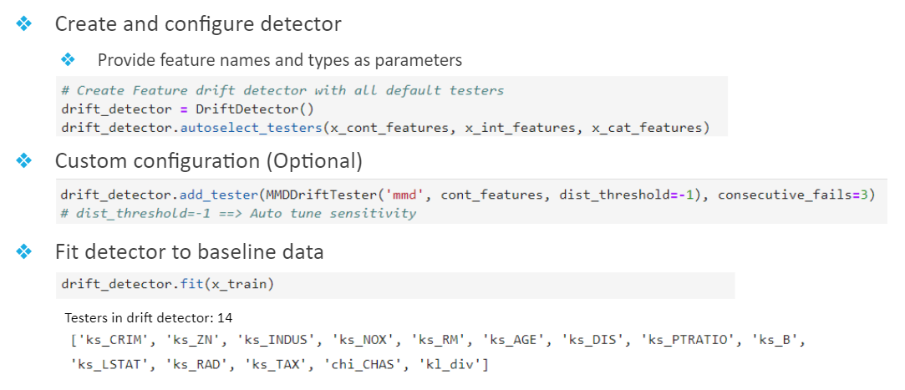
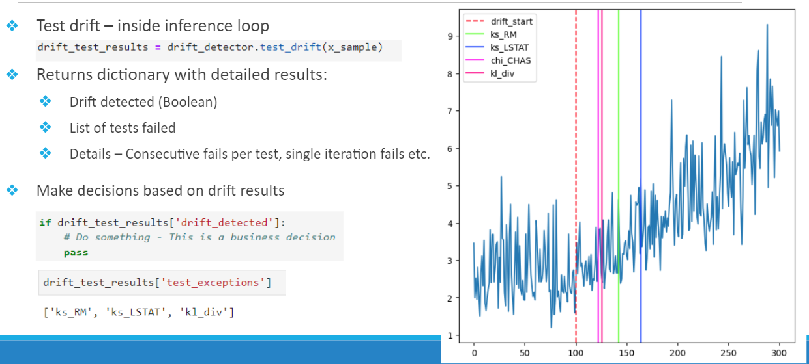

# Data Drift Detector 

This repository contains an implementation of a data drift detector, which can be used as an automatic step in a production pipeline, in order to detect drifts in Tabular datasets.

# Highlights:
- Automated statistical data drift detector module 
- Works on any tabular numerical data (Floats / Int / Categorical)
- Standard ML interface, easy to use (Create 🡪 fit 🡪 test)
- “Advanced mode” provides additional control:
  - Manual selection of statistical testers for features
  - Tester Sensitivity – using p-value
  - Tester Stability – repeated failures before alarm
- The module is extensible - very simple to add custom testers

# Implemented Data Drift Testers
- Univariate (Single feature) testers:
  - [Kolmogorov-Smirnov (KS) test](https://en.wikipedia.org/wiki/Kolmogorov%E2%80%93Smirnov_test) – For numerical features
  - [Chi-Squared goodness of fit test](https://en.wikipedia.org/wiki/Chi-squared_test) – For categorical  features
- Multivariate testers:
  - [KL Divergence test](https://en.wikipedia.org/wiki/Kullback%E2%80%93Leibler_divergence) with calculated p-val for threshold over 5 runs
  - [Maximum Mean Discrepency test](https://en.wikipedia.org/wiki/Kolmogorov%E2%80%93Smirnov_test) (Kernel based) - Numerical implementation

# Getting started

## Local installation
1. `git clone https://github.com/mryanivtal/mlops.git`

2. `pip install -r mlops/requirements.txt`

3. Depending on your local directory of the 'mlops' add the following lines to your code so that the `imports` will be found, for example assuming you used `git clone`, it will be under `mlops/`:
```python
import sys 
sys.path.append('mlops/data_drift/')
sys.path.append('mlops/data_drift/drift_detection/')
sys.path.append('mlops/data_drift/helpers/')
```

4. Follow the example in the following notebook: [Demo notebook](data_drift/data_drift_module_demo.ipynb)  (just don't forget to add #3 code `sys.path.append`)


# Basic Usage

Some code parts from the  [Demo notebook](data_drift/data_drift_module_demo.ipynb)

## How to fit a drift detector to a dataset
```python
from boston_ds import BostonDS
from drift_detection.drift_detector import DriftDetector

boston = BostonDS()
x_cont_features = boston.cont_features
x_int_features = boston.int_features
x_cat_features = boston.cat_features

# Create Feature drift detector with all default testers
drift_detector = DriftDetector()
drift_detector.autoselect_testers(x_cont_features, x_int_features, x_cat_features)
drift_detector.fit(x_train)

tests_in_detector = drift_detector.drift_test_set.get_test_names()
print('Testers in drift detector: ', len(tests_in_detector),'\n', tests_in_detector)
```


## How to test for drifts

```python
drift_test_results = drift_detector.test_drift(x_test)
# Collect data for plots later on
kpi_sample['drift_detected'] = drift_test_results['drift_detected']
kpi_sample['test_exceptions'] = drift_test_results['test_exceptions']
```


# E2E examples (Google Colab notebook)
There are 2 notebooks that demonstrate a complete inference pipeline drift detection (xgboost regressor) on 2 tabular datasets:
The Boston Housing  and French Motor Claims datasets.
As part of the pipeline we injected drift to selected features, and show how the drift detector is alerts about them.
The simplest running option is to upload the notebook to Google Colab and "run all" (it will download everything it needs when you run it).
See: [E2E notebook](data_drift/e2e_data_drift_pipeline_demo.ipynb)
(Note: you may need to restart the Colab notebook after the `pip install...` part to enable some libraries to be reloaded)

# Datasets
We used 2 datasets to demonstrate the functionality:
- [The Boston House Prices](https://www.kaggle.com/datasets/vikrishnan/boston-house-prices)
- [The French Motor Claims](https://www.kaggle.com/datasets/floser/french-motor-claims-datasets-fremtpl2freq)

See the [dataset schema PDF](data_drift/datasets_schema.pdf)

Please note that any tabular numerical data can be used as well.


